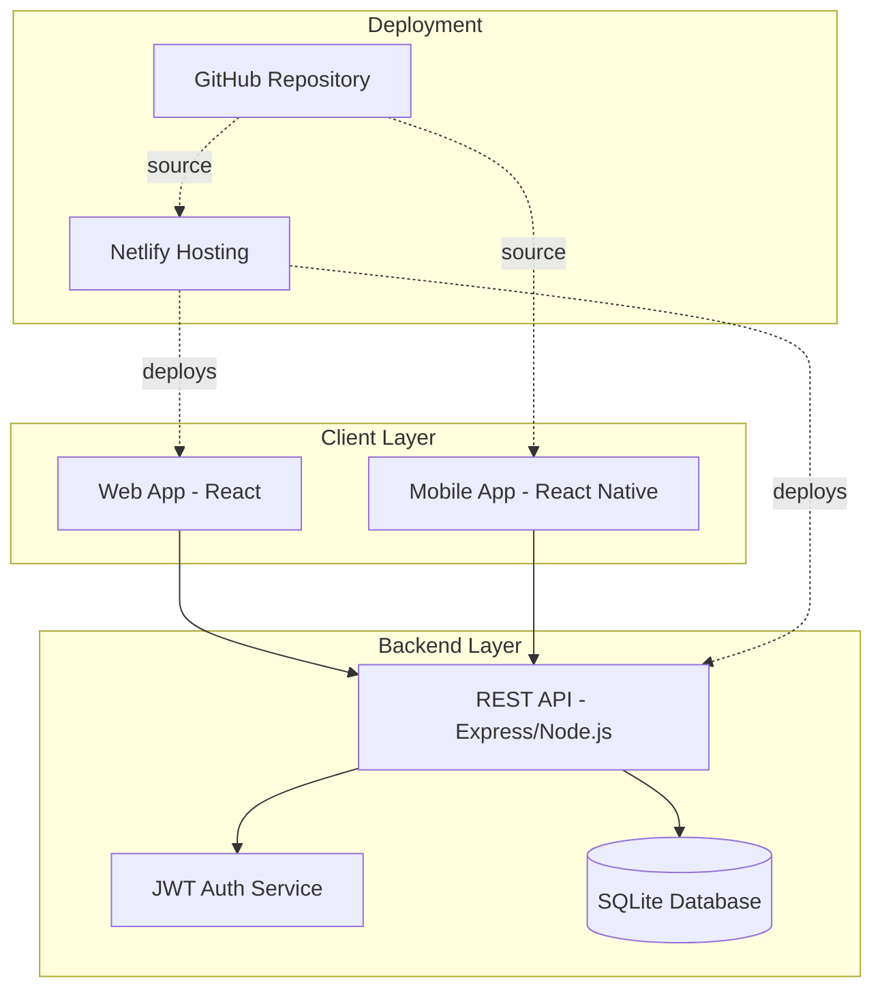
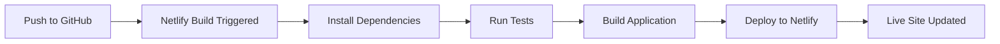

# Design Document

## Overview

The Product Feedback System is a full-stack application enabling users to submit and view product reviews and ratings, with moderation capabilities. The system consists of:

- **Web Application**: React-based SPA deployed on Netlify
- **Mobile Application**: React Native Android app
- **Backend API**: Node.js/Express REST API
- **Authentication**: JWT-based authentication with social login (OAuth) and email/password
- **Database**: SQLite for lightweight, file-based data storage
- **Hosting**: Netlify for web, GitHub for source control

This architecture ensures Windows 10 Pro compatibility, easy deployment, self-contained database, and code reusability between web and mobile platforms.

## Architecture

### High-Level Architecture



### Technology Stack

**Frontend (Web)**
- React 18.x with TypeScript
- Vite for build tooling (Windows 10 Pro compatible)
- Tailwind CSS for styling
- React Router for navigation
- Axios for API calls
- React Query for state management

**Frontend (Mobile)**
- React Native 0.72+
- TypeScript
- React Navigation
- Axios for API calls
- AsyncStorage for offline caching

**Backend**
- Node.js 18.x LTS
- Express.js 4.x
- SQLite3 (better-sqlite3 for Node.js)
- JWT (jsonwebtoken) for authentication
- Passport.js for OAuth (Google social login)
- bcrypt for password hashing
- CORS middleware

**Development Tools (Windows 10 Pro Compatible)**
- Node.js and npm (native Windows support)
- Visual Studio Code
- Android Studio for mobile development
- Git for Windows
- SQLite Browser (optional, for database inspection)

**Deployment**
- Netlify for web hosting with CI/CD
- GitHub for version control (public repository)
- Netlify Functions for serverless API endpoints with SQLite database file

### Deployment Strategy

We'll use Netlify Functions with a persistent SQLite database file. The SQLite database will be:
- Stored in the repository for initial data
- Persisted using Netlify's file system (with limitations - read-only in production)
- For production writes, we'll use a hybrid approach: SQLite for reads, external storage for writes, or deploy backend separately

**Alternative for Production** (if Netlify Functions limitations are an issue):
- Deploy backend API to a service with persistent storage (Render, Railway, or Heroku)
- Keep web app on Netlify
- SQLite database file stored with the backend service

## Components and Interfaces

### 1. Authentication Component

**Purpose**: Handle user authentication via JWT and OAuth

**Interfaces**:
```typescript
interface AuthService {
  signInWithGoogle(): Promise<User>;
  signInWithEmail(email: string, password: string): Promise<User>;
  signUp(email: string, password: string, displayName: string): Promise<User>;
  signOut(): Promise<void>;
  getCurrentUser(): User | null;
  refreshToken(): Promise<string>;
}

interface User {
  id: number;
  email: string;
  displayName: string;
  photoURL?: string;
  role: 'user' | 'moderator';
}
```

**Implementation Details**:
- JWT tokens for authentication (access token + refresh token)
- Passport.js with Google OAuth strategy for social login
- bcrypt for password hashing (email/password auth)
- Hardcoded moderator credentials in SQLite users table with role='moderator'
- Session persistence in localStorage (web) and AsyncStorage (mobile)
- Token expiration: 1 hour for access token, 7 days for refresh token

### 2. Product Management Component

**Purpose**: Display and manage the catalog of ~30 products

**Interfaces**:
```typescript
interface Product {
  id: string;
  name: string;
  description: string;
  category: string;
  imageUrl?: string;
  averageRating: number;
  totalReviews: number;
  createdAt: Date;
}

interface ProductService {
  getAllProducts(): Promise<Product[]>;
  getProductById(id: string): Promise<Product>;
  searchProducts(query: string): Promise<Product[]>;
  filterByCategory(category: string): Promise<Product[]>;
}
```

**Implementation Details**:
- Products stored in SQLite `products` table
- Server-side search with SQL LIKE queries
- Client-side filtering for better UX
- Lazy loading for product images
- Cache products locally for offline access (mobile)

### 3. Review and Rating Component

**Purpose**: Enable users to submit and view feedback

**Interfaces**:
```typescript
interface Review {
  id: string;
  productId: string;
  userId: string;
  userName: string;
  rating: number; // 1-5
  reviewText: string;
  status: 'pending' | 'approved' | 'rejected';
  createdAt: Date;
  moderatedAt?: Date;
  moderatorId?: string;
}

interface ReviewService {
  submitReview(review: Omit<Review, 'id' | 'status' | 'createdAt'>): Promise<Review>;
  getReviewsForProduct(productId: string, status?: string): Promise<Review[]>;
  updateReviewStatus(reviewId: string, status: string, moderatorId: string): Promise<void>;
  getPendingReviews(): Promise<Review[]>;
}
```

**Implementation Details**:
- Reviews stored in SQLite `reviews` table
- Indexed by productId and status for efficient queries
- Polling or WebSocket for real-time updates (optional)
- Validation: 10-1000 characters for review text, 1-5 for rating
- Average rating calculated with SQL aggregate functions and cached in products table

### 4. Moderation Component

**Purpose**: Allow moderators to review and manage feedback

**Interfaces**:
```typescript
interface ModerationService {
  getPendingReviews(): Promise<Review[]>;
  approveReview(reviewId: string, moderatorId: string): Promise<void>;
  rejectReview(reviewId: string, moderatorId: string, reason?: string): Promise<void>;
  removeReview(reviewId: string, moderatorId: string): Promise<void>;
  getModerationHistory(moderatorId: string): Promise<ModerationAction[]>;
}

interface ModerationAction {
  id: string;
  reviewId: string;
  moderatorId: string;
  action: 'approve' | 'reject' | 'remove';
  reason?: string;
  timestamp: Date;
}
```

**Implementation Details**:
- Moderator role checked via JWT token claims (role field)
- Moderation actions logged in `moderation_history` table
- Dashboard with periodic refresh for pending reviews
- Batch operations for multiple reviews using SQL transactions

### 5. API Layer (Netlify Functions)

**Endpoints**:
```
GET    /api/products              - Get all products
GET    /api/products/:id          - Get product by ID
GET    /api/products/:id/reviews  - Get approved reviews for product
POST   /api/reviews               - Submit new review (authenticated)
GET    /api/moderation/pending    - Get pending reviews (moderator only)
PUT    /api/moderation/:id        - Update review status (moderator only)
DELETE /api/reviews/:id           - Remove review (moderator only)
```

**Authentication Middleware**:
- Verify JWT token in Authorization header (Bearer token)
- Extract user ID and role from token payload
- Reject unauthorized requests with 401 status
- Reject forbidden requests (insufficient permissions) with 403 status

## Data Models

### SQLite Database Schema

**users**
```sql
CREATE TABLE users (
  id INTEGER PRIMARY KEY AUTOINCREMENT,
  email TEXT UNIQUE NOT NULL,
  password_hash TEXT,              -- NULL for OAuth users
  display_name TEXT NOT NULL,
  photo_url TEXT,
  auth_provider TEXT NOT NULL,     -- 'email' | 'google'
  role TEXT NOT NULL DEFAULT 'user', -- 'user' | 'moderator'
  created_at DATETIME DEFAULT CURRENT_TIMESTAMP
);

CREATE INDEX idx_users_email ON users(email);
```

**products**
```sql
CREATE TABLE products (
  id INTEGER PRIMARY KEY AUTOINCREMENT,
  name TEXT NOT NULL,
  description TEXT NOT NULL,
  category TEXT NOT NULL,
  image_url TEXT,
  average_rating REAL DEFAULT 0,   -- Cached average (0-5)
  total_reviews INTEGER DEFAULT 0, -- Count of approved reviews
  created_at DATETIME DEFAULT CURRENT_TIMESTAMP
);

CREATE INDEX idx_products_category ON products(category);
```

**reviews**
```sql
CREATE TABLE reviews (
  id INTEGER PRIMARY KEY AUTOINCREMENT,
  product_id INTEGER NOT NULL,
  user_id INTEGER NOT NULL,
  user_name TEXT NOT NULL,
  rating INTEGER NOT NULL CHECK(rating >= 1 AND rating <= 5),
  review_text TEXT NOT NULL CHECK(LENGTH(review_text) >= 10 AND LENGTH(review_text) <= 1000),
  status TEXT NOT NULL DEFAULT 'pending', -- 'pending' | 'approved' | 'rejected'
  created_at DATETIME DEFAULT CURRENT_TIMESTAMP,
  moderated_at DATETIME,
  moderator_id INTEGER,
  FOREIGN KEY (product_id) REFERENCES products(id) ON DELETE CASCADE,
  FOREIGN KEY (user_id) REFERENCES users(id) ON DELETE CASCADE,
  FOREIGN KEY (moderator_id) REFERENCES users(id)
);

CREATE INDEX idx_reviews_product_status ON reviews(product_id, status);
CREATE INDEX idx_reviews_status ON reviews(status);
CREATE INDEX idx_reviews_user ON reviews(user_id);
```

**moderation_history**
```sql
CREATE TABLE moderation_history (
  id INTEGER PRIMARY KEY AUTOINCREMENT,
  review_id INTEGER NOT NULL,
  moderator_id INTEGER NOT NULL,
  action TEXT NOT NULL,            -- 'approve' | 'reject' | 'remove'
  reason TEXT,
  timestamp DATETIME DEFAULT CURRENT_TIMESTAMP,
  FOREIGN KEY (review_id) REFERENCES reviews(id) ON DELETE CASCADE,
  FOREIGN KEY (moderator_id) REFERENCES users(id)
);

CREATE INDEX idx_moderation_review ON moderation_history(review_id);
CREATE INDEX idx_moderation_moderator ON moderation_history(moderator_id);
```

### Database Initialization

The database will be initialized with:
- Sample products (~30 items)
- Hardcoded moderator account (email: moderator@example.com, password: hashed)
- Sample user accounts for testing

### Data Access Layer

```typescript
interface Database {
  // User operations
  createUser(user: Omit<User, 'id'>): Promise<User>;
  getUserByEmail(email: string): Promise<User | null>;
  getUserById(id: number): Promise<User | null>;
  
  // Product operations
  getAllProducts(): Promise<Product[]>;
  getProductById(id: number): Promise<Product | null>;
  searchProducts(query: string): Promise<Product[]>;
  updateProductStats(productId: number): Promise<void>;
  
  // Review operations
  createReview(review: Omit<Review, 'id'>): Promise<Review>;
  getReviewsByProduct(productId: number, status?: string): Promise<Review[]>;
  getReviewById(id: number): Promise<Review | null>;
  updateReviewStatus(id: number, status: string, moderatorId: number): Promise<void>;
  getPendingReviews(): Promise<Review[]>;
  
  // Moderation operations
  logModerationAction(action: Omit<ModerationAction, 'id'>): Promise<void>;
  getModerationHistory(moderatorId?: number): Promise<ModerationAction[]>;
}
```

## Error Handling

### Client-Side Error Handling

**Network Errors**:
- Display user-friendly error messages
- Retry mechanism with exponential backoff
- Offline mode for mobile app (cached data)

**Validation Errors**:
- Real-time form validation
- Clear error messages near input fields
- Prevent submission until validation passes

**Authentication Errors**:
- Redirect to login page on 401 errors
- Clear session and prompt re-authentication
- Handle token expiration gracefully

### Server-Side Error Handling

**Error Response Format**:
```typescript
interface ErrorResponse {
  error: {
    code: string;
    message: string;
    details?: any;
  };
}
```

**HTTP Status Codes**:
- 200: Success
- 201: Created
- 400: Bad Request (validation errors)
- 401: Unauthorized (authentication required)
- 403: Forbidden (insufficient permissions)
- 404: Not Found
- 500: Internal Server Error

**Error Logging**:
- Log errors to console in development
- Write errors to log file in production
- Include request context (user ID, endpoint, timestamp)
- Optional: Integrate with error tracking service (Sentry)

## Testing Strategy

### Unit Testing

**Tools**: Jest, React Testing Library

**Coverage**:
- Service layer functions (auth, products, reviews)
- Utility functions (validation, formatting)
- React component logic
- API endpoint handlers

**Example Tests**:
- Validate review text length (10-1000 characters)
- Validate rating range (1-5)
- Test authentication token verification
- Test review status transitions

### Integration Testing

**Tools**: Jest, Supertest (for API)

**Coverage**:
- API endpoint workflows
- SQLite database operations (using in-memory database)
- Authentication flows
- JWT token verification

**Example Tests**:
- Submit review and verify it appears as pending in database
- Moderator approves review and it becomes visible
- User cannot access moderation endpoints (403 error)
- Product average rating updates after review approval

### End-to-End Testing

**Tools**: Playwright or Cypress (web), Detox (mobile)

**Coverage**:
- Complete user journeys
- Cross-browser compatibility (web)
- Mobile app workflows

**Example Tests**:
- User signs in, submits review, sees confirmation
- Moderator logs in, approves review, user sees it published
- User views product list, filters by category, views reviews
- Mobile app works offline with cached data

### Manual Testing Checklist

- [ ] Test on Windows 10 Pro development environment
- [ ] Verify Netlify deployment process
- [ ] Test social login (Google)
- [ ] Test email/password login
- [ ] Verify moderator permissions
- [ ] Test on multiple browsers (Chrome, Firefox, Edge)
- [ ] Test responsive design on various screen sizes
- [ ] Install and test Android APK
- [ ] Verify offline functionality on mobile
- [ ] Test with ~30 products loaded

## UI/UX Design Considerations

### Web Application Pages

1. **Home/Product List Page**
   - Grid layout of products with images
   - Search bar and category filters
   - Average rating display for each product
   - Responsive design (mobile and desktop)

2. **Product Detail Page**
   - Product information and images
   - Average rating and total review count
   - List of approved reviews (sorted by date)
   - "Write a Review" button (authenticated users)

3. **Review Submission Page**
   - Star rating selector (1-5)
   - Text area for review (10-1000 chars with counter)
   - Submit button
   - Validation feedback

4. **Moderation Dashboard** (moderators only)
   - List of pending reviews
   - Quick approve/reject actions
   - Review details modal
   - Moderation history

5. **Authentication Pages**
   - Login page with social and email options
   - Simple registration form
   - Password reset flow

### Mobile Application Screens

- Same core screens as web app
- Bottom navigation for main sections
- Pull-to-refresh for data updates
- Offline indicator and cached data access
- Native Android UI components

### Design System

**Colors**:
- Primary: Blue (#3B82F6)
- Secondary: Gray (#6B7280)
- Success: Green (#10B981)
- Warning: Yellow (#F59E0B)
- Error: Red (#EF4444)

**Typography**:
- Headings: Inter or System Font
- Body: Inter or System Font
- Monospace: Consolas (for code/IDs)

**Components**:
- Buttons: Rounded, with hover states
- Cards: Shadow, rounded corners
- Forms: Clear labels, inline validation
- Star Rating: Interactive, visual feedback

## Security Considerations

1. **Authentication**:
   - Use JWT tokens with secure signing (HS256 or RS256)
   - Implement HTTPS only (enforced by Netlify)
   - Store tokens securely (localStorage with XSS protection or httpOnly cookies)
   - Implement token refresh mechanism

2. **Authorization**:
   - Verify user roles on every API request via JWT payload
   - Check moderator role before allowing moderation actions
   - Implement middleware for role-based access control

3. **Input Validation**:
   - Sanitize all user inputs
   - Validate on both client and server
   - Prevent XSS attacks (escape HTML in reviews)
   - Rate limiting on API endpoints

4. **Data Privacy**:
   - Don't expose user email addresses publicly
   - Allow users to use display names
   - Implement data deletion on request (GDPR compliance)

5. **API Security**:
   - CORS configuration for allowed origins
   - Rate limiting to prevent abuse
   - API key protection (environment variables)

## Performance Optimization

1. **Web Application**:
   - Code splitting with React lazy loading
   - Image optimization and lazy loading
   - Caching with React Query
   - Minification and compression (Vite)

2. **Mobile Application**:
   - Offline data caching with AsyncStorage
   - Image caching
   - Lazy loading of review lists
   - Optimized bundle size

3. **Database**:
   - SQLite indexes for common queries (product_id, status, user_id)
   - Pagination for large review lists using LIMIT and OFFSET
   - Cache average ratings in products table (updated via triggers or application logic)
   - Use prepared statements to prevent SQL injection
   - Connection pooling for better performance

4. **API**:
   - Response caching where appropriate
   - Batch operations for multiple updates
   - Optimize Netlify Function cold starts

## Deployment Process

### Initial Setup

1. **Database Setup**:
   - Initialize SQLite database with schema
   - Seed database with sample products (~30 items)
   - Create hardcoded moderator account
   - Add sample user accounts for testing

2. **OAuth Setup** (for Google social login):
   - Create Google Cloud project
   - Configure OAuth 2.0 credentials
   - Set authorized redirect URIs
   - Store client ID and secret in environment variables

3. **GitHub Repository**:
   - Create public repository
   - Add README with setup instructions
   - Configure branch protection for main branch
   - Add .gitignore for node_modules, .env files, *.db files (except seed data)

4. **Netlify Setup**:
   - Connect GitHub repository
   - Configure build settings (Vite build command)
   - Set environment variables (JWT secret, OAuth credentials)
   - Enable automatic deployments
   - Configure Netlify Functions for API endpoints

### CI/CD Pipeline



**Build Configuration** (netlify.toml):
```toml
[build]
  command = "npm run build"
  publish = "dist"
  functions = "netlify/functions"

[build.environment]
  NODE_VERSION = "18"

[[redirects]]
  from = "/api/*"
  to = "/.netlify/functions/:splat"
  status = 200

[[redirects]]
  from = "/*"
  to = "/index.html"
  status = 200
```

### Android App Deployment

1. Build APK using Android Studio on Windows 10 Pro
2. Test on physical device or emulator
3. Generate signed APK for distribution
4. Distribute via GitHub Releases or direct download
5. (Optional) Publish to Google Play Store

## Development Workflow (Windows 10 Pro)

### Setup Instructions

1. Install Node.js 18.x LTS from nodejs.org
2. Install Git for Windows
3. Install Visual Studio Code
4. Install Android Studio (for mobile development)
5. Clone repository: `git clone <repo-url>`
6. Install dependencies: `npm install`
7. Install Netlify CLI: `npm install -g netlify-cli`
8. Initialize database: `npm run db:init`
9. Configure environment variables (.env file)
10. Run development server: `npm run dev`

### Environment Variables

**Backend (.env)**
```
JWT_SECRET=<your-secret-key>
JWT_REFRESH_SECRET=<your-refresh-secret>
GOOGLE_CLIENT_ID=<your-google-client-id>
GOOGLE_CLIENT_SECRET=<your-google-client-secret>
GOOGLE_CALLBACK_URL=http://localhost:8888/api/auth/google/callback
DATABASE_PATH=./database/feedback.db
```

**Frontend (.env)**
```
VITE_API_URL=http://localhost:8888/api
VITE_GOOGLE_CLIENT_ID=<your-google-client-id>
```

### Local Development

- Web + API: `netlify dev` (runs both frontend and functions on http://localhost:8888)
- Web only: `npm run dev` (Vite dev server on http://localhost:5173)
- Mobile: `npm run android` (React Native)
- Database inspection: Use SQLite Browser or `sqlite3 database/feedback.db`

## Future Enhancements

- Email notifications for review status updates
- User profile pages with review history
- Product comparison feature
- Advanced analytics dashboard for moderators
- iOS mobile application
- Multi-language support
- Image uploads with reviews
- Reply functionality for product owners
- Sentiment analysis for reviews
- Export reviews to CSV/PDF
